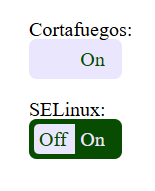

## 1. Desarrolla un componente de interruptor ("switch") en una página web que permita visualizar el estado de dos configuraciones, "Cortafuegos" y "SELinux".

## 2. El componente debe permitir cambiar el estado de ambas configuraciones, de "On" a "Off" y viceversa.

## 3. Debe quedar como en la siguiente imagen:
